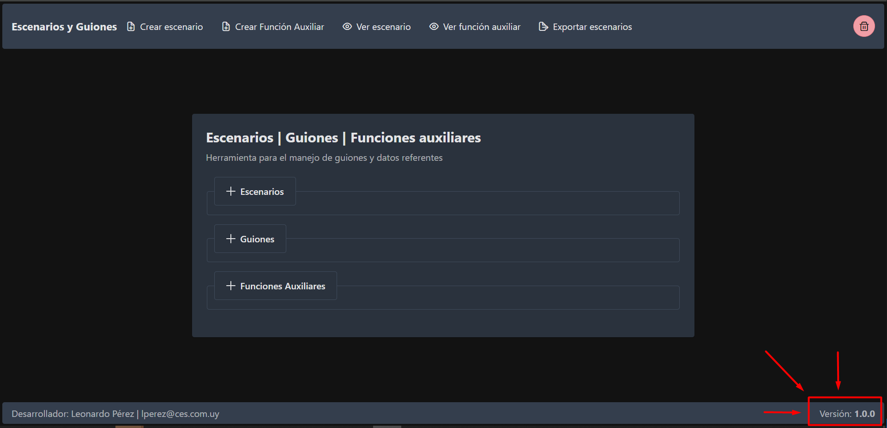

# Escenarios y Guiones

Herramienta para el manejo de guiones y datos referentes.

## Demo

[Funcionamiento de la herramienta](../adminces/README/demo.webm)

## Ejecución y construcción

Parados en la carpeta raíz:

```ts
// Modo desarrollo
npm run dev

// Modo desarrollo - exponer en la red
// Obtenemos url de acceso a la aplicación
npm run dev --host

// Construcción de nuestra solución
npm run build
```

## Versión

Es importante mantener un control de la version de la aplicación en el archivo `package.json`. Dicha versión se ve reflejada en producción.


